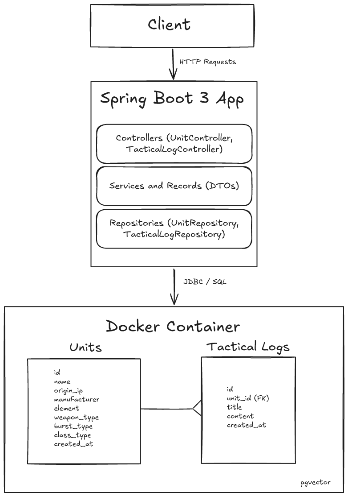
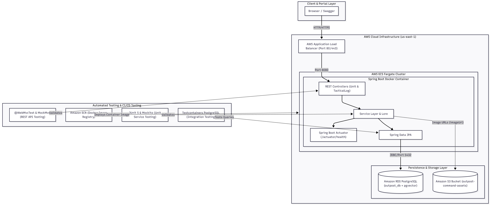

# Outpost Command — Tactical Roster & Intelligence Service

> A production-grade backend service built with Spring Boot 3 and PostgreSQL (pgvector) to manage combat units and tactical intelligence for *Goddess of Victory: Nikke* and external crossover IPs. Designed as Phase 1 of an eventual event-driven microservices architecture featuring RAG-powered AI agents.

---

## System Architecture (Phase 1 Monolith)

The system follows a clean layered monolithic architecture that cleanly isolates client interfaces, business logic, data access, and storage.



### Architectural Layers Breakdown

1. **Client Tier**
   * Communicates with the service via standard HTTP REST APIs returning standard JSON payloads on port `:8080`.
   * Designed for easy consumption by modern web/mobile frontends, Postman, or Bruno API clients.

2. **Spring Boot 3.x Application Tier**
   * **Controller Layer (`UnitController`, `TacticalLogController`):** Manages inbound HTTP routing, request payload validation (`hibernate-validator`), and HTTP status mapping.
   * **Service & DTO Layer (`Records / Services`):** Encapsulates core business logic, entity-to-DTO conversion using modern **Java Records**, transaction management (`@Transactional`), and validation rules.
   * **Repository Layer (`UnitRepository`, `TacticalLogRepository`):** Abstraction layer over data operations using **Spring Data JPA / Hibernate**.

3. **Database Tier (Dockerized PostgreSQL + pgvector)**
   * Hosted inside a Docker container (`pgvector/pgvector:pg16`) running on port `:5432`.
   * **`units` Table:** Stores unit stats, weapon types, elements, burst types, and crossover metadata (`origin_ip`).
   * **`tactical_logs` Table:** Stores unstructured text logs, strategy guides, and skill notes linked via a `1-to-Many` foreign key relationship to a unit.
   * **AI-Ready (`pgvector`):** Utilizes PostgreSQL with `pgvector` pre-installed to avoid database migrations when converting tactical logs into vector embeddings in Phase 3.

---

## Phase 1 Tech Stack

* **Language:** Java 17+ or Java 21
* **Framework:** Spring Boot 3.x (Spring Web, Spring Data JPA, Validation)
* **Database:** PostgreSQL (`pgvector/pgvector:pg16` Docker Image)
* **ORM:** Hibernate / JPA
* **Build Tool:** Gradle / Maven

# Outpost Command — Tactical Roster & Intelligence Service

> A production-grade, cloud-native backend service built with Spring Boot 3 and PostgreSQL (`pgvector`) to manage combat units and tactical intelligence for *Goddess of Victory: Nikke* and external crossover IPs. Containerized via Docker and deployed on AWS ECS Fargate behind an Application Load Balancer with Amazon RDS PostgreSQL.

---

## 🏛️ System Architecture (Phase 2 Cloud Architecture)

The system follows a containerized, cloud-native architecture deployed across a dedicated AWS Virtual Private Cloud (VPC), providing isolated public routing, serverless compute, managed relational persistence, and automated health probing.



### 🧱 Architectural Breakdown

1. **Client Tier**
   * Communicates with the service via standard HTTP/REST requests returning structured JSON payloads.
   * Consumable by web/mobile frontends, Postman, or external microservices.

2. **Edge & Traffic Ingress (AWS ALB)**
   * **AWS Application Load Balancer (ALB):** Internet-facing public entrypoint (Port `:80`) routing traffic across Availability Zones to container targets on Port `:8080`.
   * **Health & Probing (`outpost-tg`):** Integrates with Spring Boot Actuator (`/actuator/health`, liveness, and readiness probes) to guarantee zero-downtime routing.

3. **Compute & Orchestration Tier (AWS ECS Fargate)**
   * **Serverless Container Execution:** Runs within an Amazon ECS Cluster (`outpost-cluster`) using AWS Fargate for serverless scaling and task placement.
   * **Spring Boot 3 Application Core:**
     * **Controller Layer (`UnitController`, `TacticalLogController`):** HTTP routing, request payload validation (`jakarta.validation`), and global exception mapping.
     * **Service Layer:** Business logic encapsulation, DTO conversion via **Java 21 Records**, and transactional integrity (`@Transactional`).
     * **Repository Layer:** Data access abstraction powered by **Spring Data JPA / Hibernate**.
     * **Observability:** Actuator probes monitoring JVM state, memory, disk, and live database connectivity.

4. **Container Registry & Security (Amazon ECR)**
   * Private container registry storing optimized, multi-stage production Docker images (<200MB) running under non-root permissions (`spring:spring`) with zero High/Critical CVE vulnerabilities.

5. **Cloud Database Tier (Amazon RDS PostgreSQL + pgvector)**
   * Managed **PostgreSQL 16** instance (`outpost-db`) with dedicated VPC security groups (`outpost-rds-sg`).
   * **`units` Table:** Persists combat attributes, weapon types, elements, burst types, and crossover metadata.
   * **`tactical_logs` Table:** Persists unstructured battle guides, synergy notes, and lore connected via a `1-to-Many` foreign key relationship.
   * **AI-Ready Vector Store (`pgvector`):** Configured with the native `vector` extension, establishing the vector storage engine for Phase 3 Multimodal Art Search and RAG tactical retrieval.

---

## 🛠️ Phase 2 Tech Stack

* **Core Language & Framework:** Java 21, Spring Boot 3.x (Spring Web, Spring Data JPA, Spring Validation, Actuator)
* **Cloud Infrastructure (AWS):** ECS (Fargate), Application Load Balancer (ALB), Amazon ECR, Amazon RDS (PostgreSQL 16)
* **Vector Database:** PostgreSQL with `pgvector` extension
* **Testing & Quality Assurance:** JUnit 5, Mockito, MockMvc (`@WebMvcTest`), Testcontainers PostgreSQL (`@ServiceConnection`)
* **DevOps & Containerization:** Multi-Stage Dockerfile (Alpine JRE), Postman Collection Runner, Maven

---

## 🧪 Automated Testing Suite

The project enforces a strict test pyramid:
* **Unit Tests (`UnitServiceImplTest`):** Business logic and duplicate/not-found exception validation via JUnit 5 & Mockito.
* **API Controller Tests (`UnitControllerTest`):** MockMvc endpoint routing, status codes (`201`, `400`, `404`, `409`), and RFC 7807/custom error handling.
* **Integration Tests (`UnitRepositoryTest`):** Ephemeral PostgreSQL container testing via **Testcontainers** and `@ServiceConnection`.

To run all automated tests locally:
```bash
./mvnw clean test

---

## Quick Start Guide

### 1. Prerequisites
* **JDK 17** or higher installed.
* **Docker** & **Docker Compose** installed.

### 2. Run Database Container
Spin up the `pgvector` container in the background:
```bash
docker compose up -d
